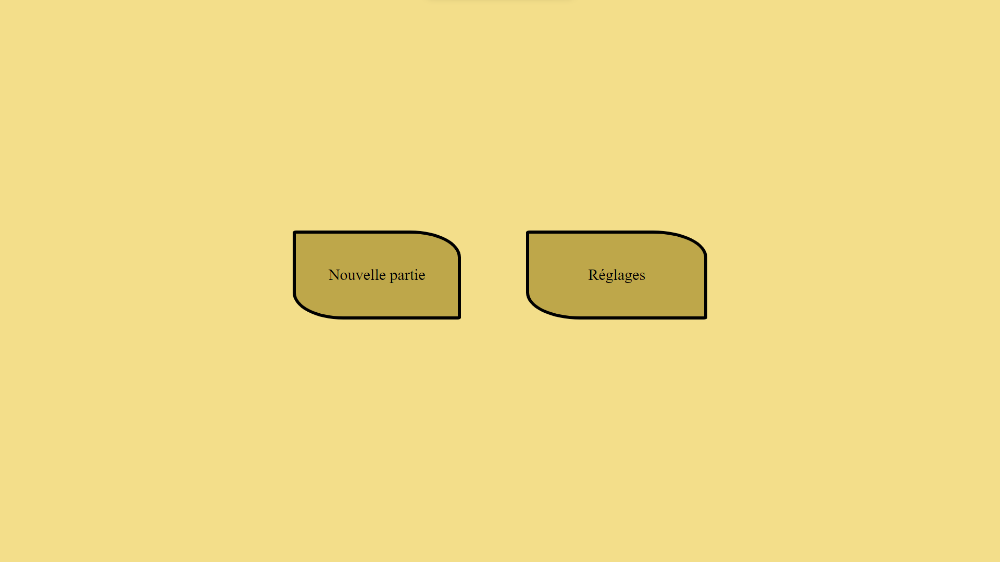
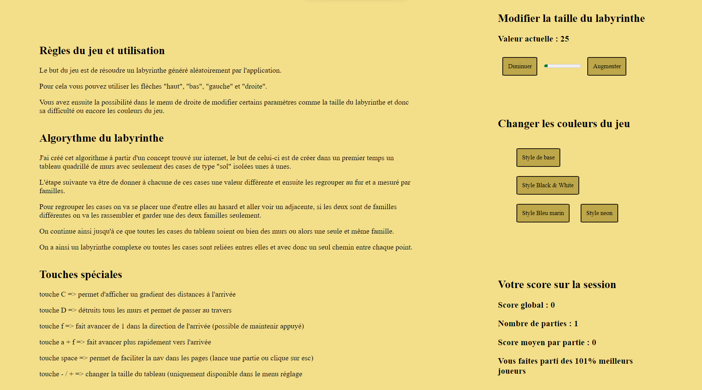
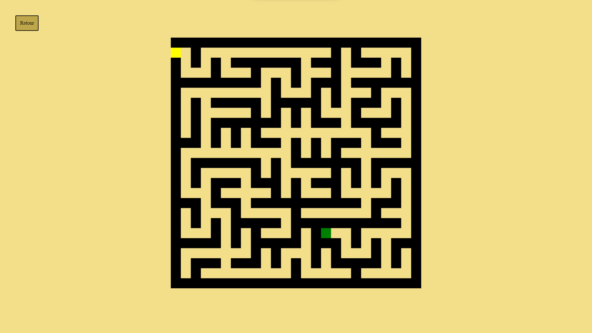

# Mazzy

## Project presentation

I realized this project in the context of a project at [IUT Lyon 1](https://iut.univ-lyon1.fr/) in the second year of study.
This is an interactive and customizable game that implements a maze generation algorithm, inspired by [this video](https://www.youtube.com/watch?v=K7vaT8bZRuk), which I made myself.
It is possible to play with a maze ranging from 7 to 201 in length/width and solve it by yourself or using solving tools.

## Add your files

- [ ] [Find the GitHub repository here](https://github.com/Hubrec/projet-mazzy) you can get all the code here, the repository is public so you can clone the project at your convenience.

## Try it now

You can try the game [clicking on this](https://mazzy-project.netlify.app/) instantly.

## Visuals

Here below are the different visuals of the application :
 - the first visual is that of the home page

    

 - the second visual is that of the settings page

    

 - and for the last visual, this is the main game page

    

## Usage

This web application project aims to be played above all because it is an entertaining game, but also to implement the algorithm for generating labyrinths.

## Authors

**Mathis Guerin**

- [ ] [My GitHub](https://github.com/Hubrec)
- [ ] [My Linkedin](https://www.linkedin.com/in/mathis-guerin-43b228222/)

## License

This project is open source.

## Project status

This project is destined to be modified and know new developments in the future, this version is a stable and runnable version but still needs improvements.
